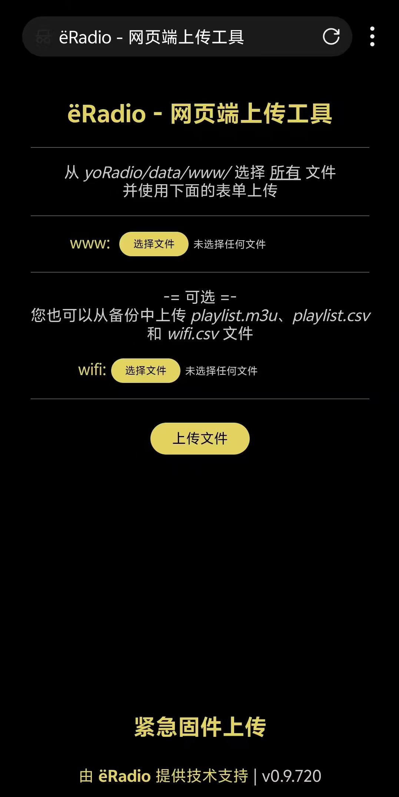
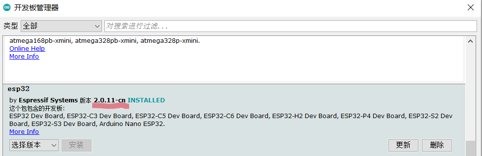
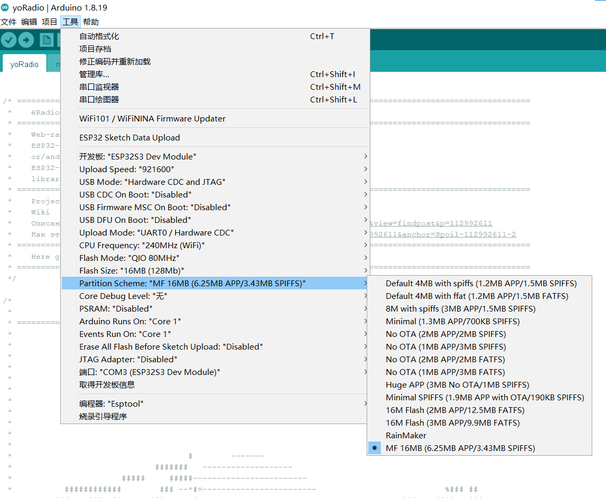

基于微雪ESP32-S3-Touch-LCD-2.8的yoradio。
https://www.waveshare.net/wiki/ESP32-S3-Touch-LCD-2.8 
汉化（包括网络端）；
音量调节做了映射。
添加支持M3U格式播放，playlist.csv文件与playlist.m3u同时存在时只初始化M3U列表。
遇到链接不畅的电台重启1次就不在自动播放。

触摸控制播放列表（长按左上部分打开电台列表，长按右上部分打开sd卡列表，滑动选择单击后，中间高亮选中项开始播放）；
播放控制（点击播放或暂停，上半部分左滑列表下一项，右滑上一项）；
调节音量（屏幕下部左右滑动）；
调节亮度（屏幕右侧上下滑动）；
3分钟无操作息屏，短按电源键亮屏；
亮屏时短按电源键切换播放模式，长按电源键松手关机。

如需修改注意编译环境设置和开发板版本选择。
----------------------------------------------------------------------------------------------
为了存放更多电台，可以修改spiffs分区大小，如果你不需要就不必更改。
目的：增大spiffs空间，便于存放更多电台的playlist.csv文件（minimal spiffs空间只有190kb）
方法：https://wiki.makerfabs.com/Larger%20flash%20and%20memory.html

  
  
